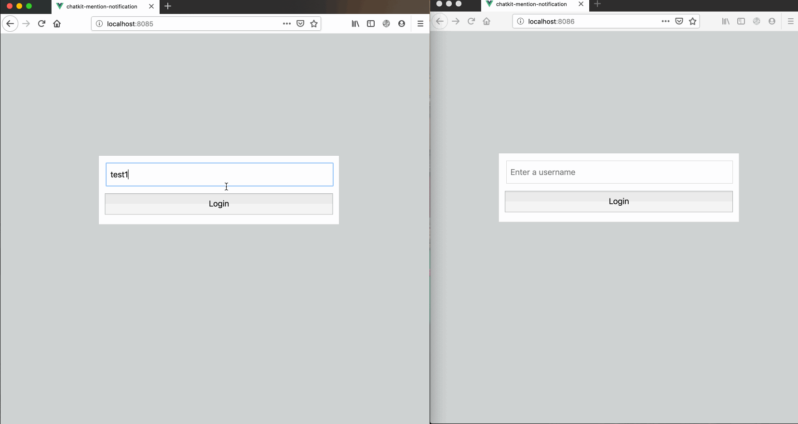

# Alert users when they are mentioned in your Chatkit app using Web Push Notification

This is a demo application showing how to notify users of their mentions in Chatkit. You can read more on how this was built [here](https://pusher.com/tutorials/chatkit-mention-notification).




## Project setup

First, clone the repository:
```
git clone https://github.com/dongido001/chatkit-notify-mentions.git
```

Go to the project folder:

```
cd chatkit-keyword-mod
```

Create your env file:

```
cp .env.example .env
```
- Update `<YOUR_CHATKIT_SECRET_KEY>`, `<YOUR_CHATKIT_INSTANCE_LOCATOR>`, `<YOUR_CHATKIT_TOKEN_ENDPOINT>` with your [Chatkit keys](https://pusher.com/chatkit)

- Generate a Vapid key and update the .env file with the key
```sh
 ./node_modules/.bin/web-push generate-vapid-keys
```
 Then update `<YOUR_VAPID_PUBLIC_KEY>` and `<YOUR_VAPID_PRIVATE_KEY>` placeholders with your actual keys.

> You will need to create some users and rooms on your Chatkit app

### Client - Vue

```
npm install
npm run serve
```

### Server - Node

```
npm run server

#OR

cd server
node app.js
```
